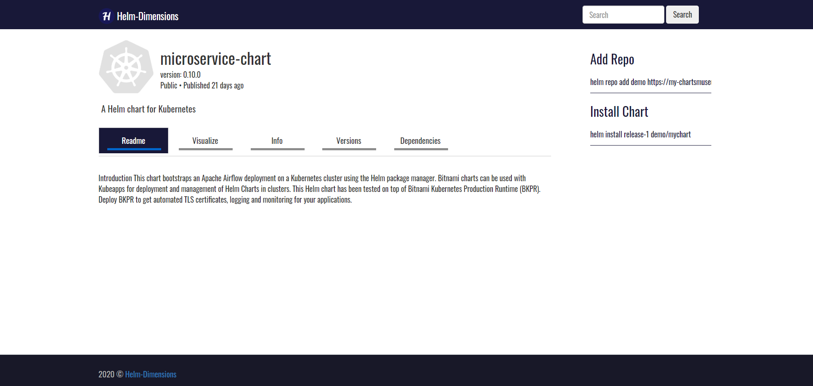

# Helm-Dimensions

[](https://github.com/tterb/atomic-design-ui/blob/master/LICENSEs)
[](https://badge.fury.io/gh/tterb%2FHyde)

Helm-Dimensions is a web UI dashboard to visualize and manage charts in your Helm repo server. The application is fully written in go language using the gin-gonic web framework.

<div style="display:flex">
</div>

## Limitations
The current version only supports Chartmuseum Helm server, future release will support all sorts of Helm servers

## Build with

* [gin-gonic](https://gin-gonic.com/) - The web framework for GO
* [go](https://golang.org/) - Programing language

## Working Locally with Chartmuseum Server
```
# Provide the chartmuseum server url
setx CHART_MUSEUM_URL "http://my-chartmuseum-server"

go build

./helm-dimensions
```
