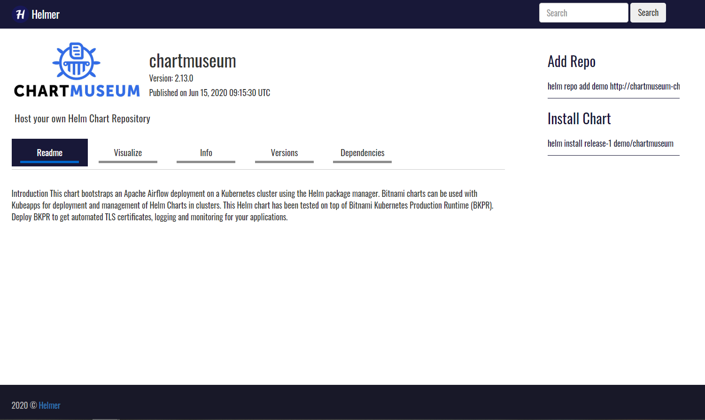

# Helmer

[](https://github.com/tterb/atomic-design-ui/blob/master/LICENSEs)
[](https://badge.fury.io/gh/tterb%2FHyde)

helmer is a web UI dashboard to visualize and manage charts in your Helm repo server. The application is fully written in go language using the gin-gonic web framework.

</div>

## Limitations
The current version only supports Chartmuseum Helm server, future release will support all sorts of Helm servers

## Build with

* [gin-gonic](https://gin-gonic.com/) - The web framework for GO
* [go](https://golang.org/) - Programing language

## Configuration

| Parameter          | Default                  | Description          |
| ------------------ | ------------------------ | ---------------------|
|CHART_MUSEUM_URL    | http://localhost:9000    |  URL Endpoint of your chartmuseum server |
|CHART_MUSEUM_API    | /api/charts              |  Chartmuseum API Endpoint                |
|APP_PORT            | 5000                     |  Application Port                        |

## Working Locally

```
go build

./helmer
```
