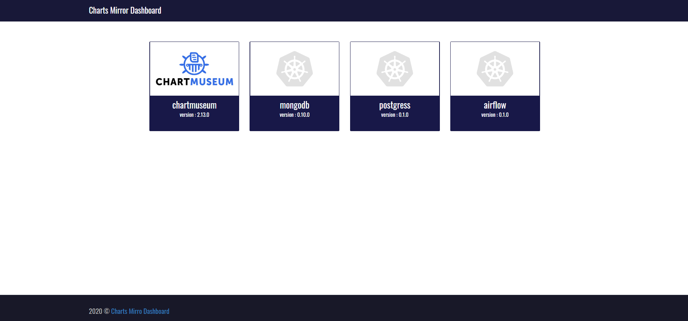

# chartsMirror

ChartsMirror is a web UI dashboard to connect to your Helm chart server. It will allows you to manage the charts in your Chartserver with the interactive UI. The application is fully written in go language using the gin-gonic web framework.



## Limitations
The current version only supports Chartmuseum Helm server, future release will support all sorts of Helm servers

## Build with

* [gin-gonic](https://gin-gonic.com/) - The web framework for GO
* [go](https://golang.org/) - Programing language

## Working Locally with Chartmuseum Server
```
# Provide the chartmuseum server url
setx CHART_MUSEUM_URL "http://my-chartmuseum-server"

go build

./chartsmirror
```
