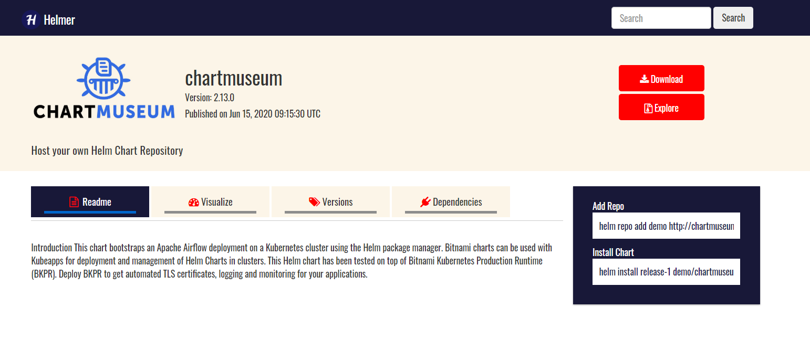

#  Helmer

[](https://github.com/tterb/atomic-design-ui/blob/master/LICENSEs)
[](https://badge.fury.io/gh/tterb%2FHyde)

Helmer is a web UI dashboard to visualize and manage charts in your Helm repo server. The application can be self-hosted to connect to private Helm repository along with other Public 



## Limitations
The current version only supports Chartmuseum Helm server, future release will support all sorts of Helm servers

## Development

The application is fully written in go language using the gin-gonic web framework.

* [gin-gonic](https://gin-gonic.com/) - The web framework for GO
* [go](https://golang.org/) - Programing language
* [go-modules](https://github.com/golang/go/wiki/Modules) - Go Package management

You need go 1.11+ installed in the machine for building the application without Docker. 

Development using Docker

```s
# Setup env file for docker-compose
file="app.env"
echo "CHART_MUSEUM_URL=http://localhost:9000" > $file

docker-compose up
```

## Configuration

| Parameter          | Default                  | Description          |
| ------------------ | ------------------------ | ---------------------|
|CHART_MUSEUM_URL    | http://localhost:9000    |  URL Endpoint of your chartmuseum server |
|CHART_MUSEUM_API    | /api/charts              |  Chartmuseum API Endpoint                |
|APP_PORT            | 5000                     |  Application Port                        |
